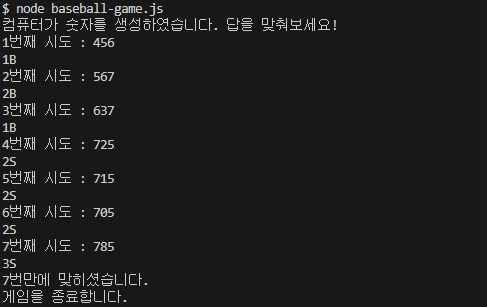
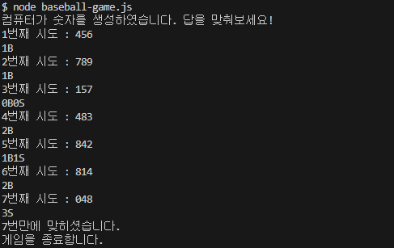

# ⚾ 숫자야구 프로그램 만들기

[**⚾ 주차 별 팀 과제**](https://teamsparta.notion.site/2bf4c036bf0c4e698e956a661ea3796a)

## 📝 구현 과정

### ✏️ 1. 랜덤 세자리 수 생성 함수

#### 방법 1. 

```js
// 랜덤 세자리 수 생성 함수 1 (박경덕)
function generateNumber() {
    let numbers = [0, 1, 2, 3, 4, 5, 6, 7, 8, 9];
    let answer = '';
    for (let i = 0; i < 3; i++) {
      let index = Math.floor(Math.random() * numbers.length);
      answer += numbers[index];
      numbers.splice(index, 1); // numbers에서 선택된 숫자 제거
    }
    return answer;
}
```

#### 방법 2. 

```js
// 랜덤 세자리 수 생성 함수 2 (김정우)
function makeTarget() {
    let targetSet = new Set(); // Set 객체에 중복되지 않는 값 저장
    while (targetSet.size < 3) { // 세자리 수가 될 때까지 반복
        // 0 ~ 9 까지 랜덤한 수를 targetSet에 추가
        targetSet.add(Math.floor(Math.random() * (10 - 0) + 0)); 
    }
    return [...targetSet].join(""); // String으로 return
}
```

#### ~~방법 3. (폐기)~~

```js
// 랜덤으로 생성된 숫자의 적합성 확인
function condition(num) {
    num = String(num);
    let temp = num.split("");
    // 첫번째와 두번째, 첫번째와 세번째, 두번째와 세번째의 숫자의 중복 확인
    if (temp[0] == temp[1] || temp[0] == temp[2] || temp[1] == temp[2]) {
        return true; // 중복이 있을 때 (부적합)
    } else if (num < 100 || num >= 1000) {
        return true; // 생성된 수가 세자리 수가 아닐 때 (부적합)
    } else {
        return false; // 중복이 없고 세자리 수인 경우 (적합)
    }
}

let target;
do {
    target = Math.floor(Math.random() * 1000); // 1000이하의 랜덤 수 생성
} while (condition(target)) // 랜덤으로 생성된 숫자의 적합성 확인 후 반복문 종료
```

⚠️ 폐기 이유 : 0으로 시작하는 세자리 수를 만들 수 없음

### ✏️ 2. 정답 비교 함수

#### 방법 1.
```js
// 정답 비교 함수 (볼, 스트라이크 판단)
function compare(target, guess) {
    let target_temp = target.split(""); // target 값 배열화
    let guess_temp = guess.split(""); // guess 값 배열화
    let strikes = 0;
    let balls = 0;

    for (let i = 0; i < 3; i++) {
        if (guess_temp[i] === target_temp[i]) {
            strikes++; // 위치와 값이 같을 때, strike
        } else if (target_temp.includes(guess_temp[i])) {
            balls++; // 값을 포함하고만 있을 때, ball
        }
    }
    return { balls, strikes };
}
```

#### 방법 2. 
```js
function compare(target, guess) {
    let guess_temp = guess.split("");
    let strikes = 0;
    let balls = 0;

    guess_temp.forEach((num, index) => num === target.charAt(index)
    ? strikes++ : target.includes(num) && balls++)

    return { balls, strikes };
}
```

### ✏️ 3. 입출력 구현
```js
// readline 모듈 불러오기
const readline = require("readline");

// 인터페이스 생성하기
const rl = readline.createInterface({
    input: process.stdin,
    output: process.stdout
});

// 게임 시작
console.log("컴퓨터가 숫자를 생성하였습니다. 답을 맞춰보세요!")
let count = 1; // 시도 횟수

rl.question(`${count}번째 시도 : `, function guess(input) {
    // 입력값이 세자리 수가 아닌 경우 재시도
    if(input.length !== 3) {
        console.log("세자리 숫자를 입력해주세요.");
        rl.question(`${count}번째 시도 : `, guess);
        return;
    }
    
    // 정답 비교 함수 수행 후 balls, strikes에 값 할당
    let { balls, strikes } = compare(target, input);
    
    // 볼, 스트라이크를 표현하여 출력
    if (balls === 0 && strikes === 0) {
        console.log(balls + "B" + strikes + "S");
    } else if (balls === 0) {
        console.log(strikes + "S");
    } else if (strikes === 0) {
        console.log(balls + "B");
    } else {
        console.log(balls + "B" + strikes + "S");
    }
    
    // 3S로 맞췄을 경우 입력 종료
    if (strikes === 3) {
        rl.close();
    } else { // 아닐 경우 count 더하여 재시도
        count++;
        rl.question(`${count}번째 시도 : `, guess);
    }
})

// 입력 종료 후 결과 출력
rl.on("close", () => {
    console.log(`${count}번만에 맞히셨습니다.\n게임을 종료합니다.`);
	process.exit();
});
```

## 🚀 결과



